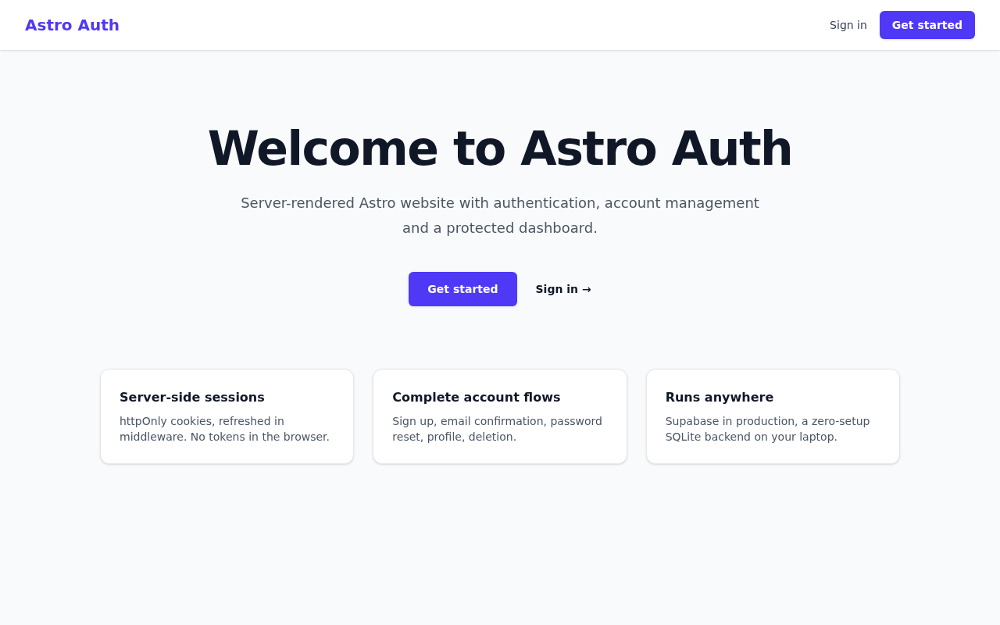
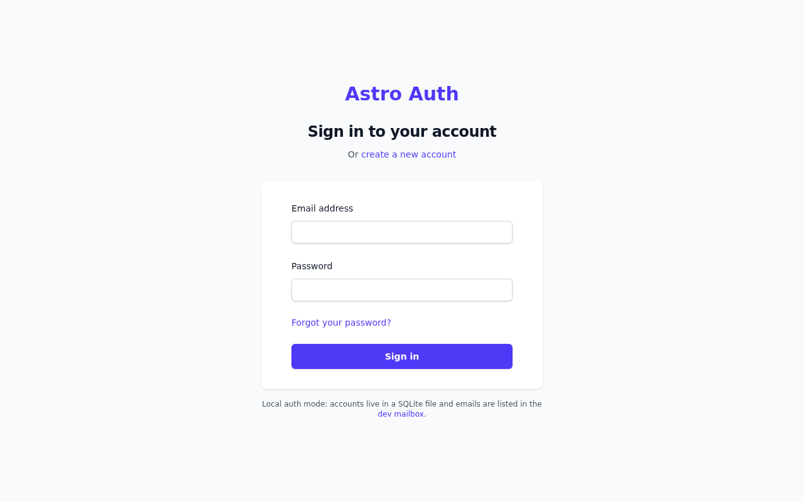
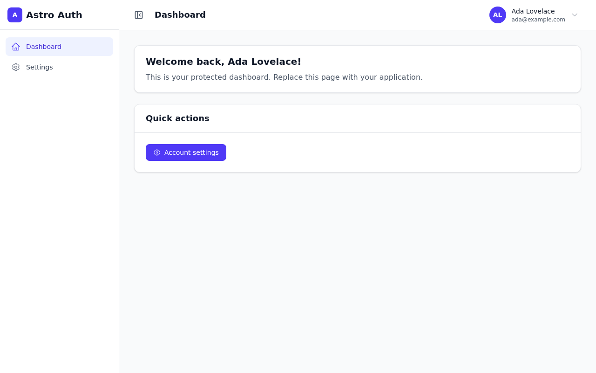
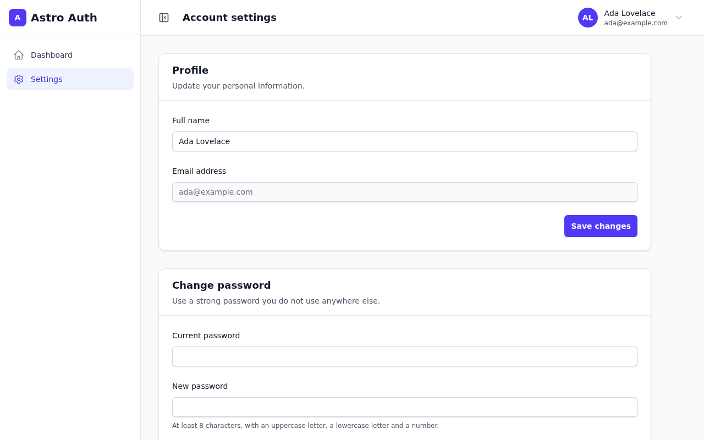
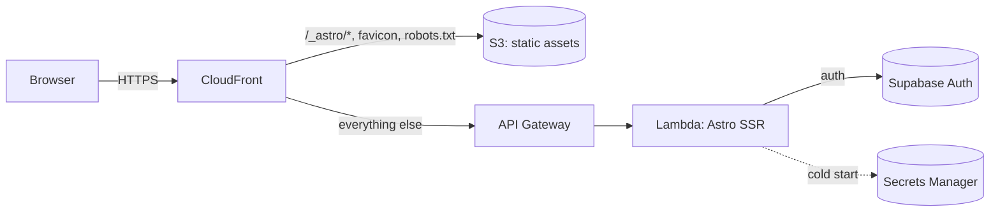
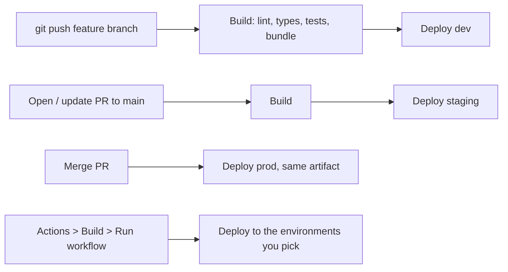

# SSR Website Auth Astro Template

A production-ready starting point for an **authenticated, server-rendered
website**: Astro SSR, Supabase Auth, account management, a protected dashboard,
and a complete AWS deployment (CloudFront + S3 + API Gateway + Lambda) driven
by Terraform and GitHub Actions.

It runs on your laptop in two minutes **without any account** (a built-in
SQLite auth backend), and in production on Supabase + AWS.

| Home | Sign in | Dashboard | Account |
| --- | --- | --- | --- |
|  |  |  |  |

## Features

- **Complete auth flows**: sign up, email confirmation, sign in, sign out,
  forgot / reset password, profile update, password change, account deletion.
- **Server-side sessions**: httpOnly cookies refreshed in middleware; the
  browser never holds a token. Protected routes, guest-only routes, safe
  "return to the page you wanted" redirects.
- **Two auth backends, one interface**: Supabase in production, a zero-setup
  local SQLite backend (with a dev mailbox for emails) for development and tests.
- **AWS hosting as code**: CloudFront in front of a private S3 bucket (static
  assets) and a Lambda (SSR), security headers, optional custom domains, one
  isolated stack per environment (`dev`, `staging`, `prod`).
- **CI/CD**: push a branch and it is live on `dev`; open a PR for `staging`;
  merge for `prod`. Deploy or roll back any build to any environment from the
  GitHub UI.
- **Tested**: 100+ unit tests, browser end-to-end tests with accessibility
  checks (run against the real Lambda bundle), a packaged-Lambda smoke test,
  and offline Terraform tests.
- **AI-assistant ready**: `AGENTS.md` / `CLAUDE.md` project rules, a `/ship`
  command that verifies, commits and pushes (which deploys), and an optional
  `@claude` GitHub Action.

## Quick start (local, no account needed)

Requirements: **Node.js 22.13+** (24 recommended) and **pnpm** (`corepack enable`).

```sh
git clone <your-repo-url> my-app && cd my-app/website
pnpm install
pnpm dev
```

Open http://localhost:4321 and create an account. With no configuration the
app uses the **local auth provider**: users live in `website/.data/`, and the
emails it would send (confirmation, password reset) are listed at
http://localhost:4321/dev/mailbox.

To use Supabase instead, copy `website/.env.example` to `website/.env` and
fill in your project URL and publishable key. Everything else stays the same.
See [Local development](docs/local-development.md).

## How it works



- **Astro** renders pages on the server. `src/middleware.ts` resolves the
  signed-in user on every request and applies the route rules.
- **Auth** goes through one interface (`src/lib/auth`). The Supabase provider
  uses `@supabase/ssr` with httpOnly cookies; the local provider uses Node's
  built-in SQLite. Pick one with environment variables, no code change.
- **AWS**: static files come from S3 through CloudFront; every other request
  goes to a Lambda running the Astro server build. Runtime configuration
  (Supabase keys) is loaded from AWS Secrets Manager at cold start, never baked
  into the build.
- **Terraform** (`infrastructure/`) creates one isolated stack per enabled
  environment. **GitHub Actions** build once per commit and promote that same
  artifact through `dev`, `staging` and `prod`.

Details: [Architecture](docs/architecture.md).

## Deployment flow



| You do | What happens |
| --- | --- |
| Push to any branch except `main` | Build + deploy to **dev** |
| Open or update a PR to `main` | Build + deploy to **staging** (if enabled) |
| Merge the PR | The PR's artifact is promoted to **prod** (no rebuild) |
| Run **Build** manually | Build, then deploy to the environments you list (or all) |
| Run **Deploy** manually | Deploy any previously built commit to one environment (rollback) |
| Push changes under `infrastructure/` to `main` | Terraform apply for every enabled environment |

Details and first-time AWS setup: [Deployment](docs/deployment.md).

## Work on it with an AI assistant

The repository is set up so an AI coding assistant (Claude Code, Codex, Cursor,
Copilot...) can work on it safely:

- [`AGENTS.md`](AGENTS.md) holds the project rules: commands, structure,
  conventions, and what never to touch (secrets, `main`, state files).
  `CLAUDE.md` imports it for Claude Code.
- In Claude Code, **`/ship`** runs the checks, writes a conventional commit
  and pushes your branch, which deploys it to `dev`. **`/deploy staging`**
  triggers a deployment of an environment through GitHub Actions.
- Optional: mention **`@claude`** in an issue or PR and the
  [Claude GitHub Action](.github/workflows/claude.yml) answers, reviews, or
  opens a PR.

Details: [AI assistant](docs/ai-assistant.md).

## Documentation

| Guide | What it covers |
| --- | --- |
| [Getting started](docs/getting-started.md) | First-time setup checklist: Supabase, AWS, GitHub, first deploy |
| [Local development](docs/local-development.md) | Local SQLite mode, Supabase CLI, hosted Supabase, commands |
| [Configuration](docs/configuration.md) | Every environment variable, secret and repository variable |
| [Architecture](docs/architecture.md) | Request flow, auth design, Lambda adapter, caching, security |
| [Deployment](docs/deployment.md) | CI/CD pipeline, environments, manual deploys, domains, rollback |
| [Customization](docs/customization.md) | Rename, add pages and API routes, store user data |
| [Testing](docs/testing.md) | Unit, end-to-end, Lambda smoke and Terraform tests |
| [AI assistant](docs/ai-assistant.md) | AGENTS.md, `/ship`, `@claude` |
| [Security checklist](docs/SECURITY_CHECKLIST.md) | What to review before going live |

## Repository layout

```text
.
├── website/                 Astro app (pnpm project)
│   ├── src/
│   │   ├── middleware.ts    session + route protection on every request
│   │   ├── lib/auth/        auth interface, Supabase + local providers
│   │   ├── pages/           pages, API routes (pages/api), /auth/callback
│   │   ├── components/      Preact islands (forms, dashboard shell, UI)
│   │   └── layouts/         page shells
│   ├── ssr/                 AWS Lambda adapter + local Lambda server
│   ├── tests/               unit (Vitest) and e2e (Playwright) tests
│   └── supabase/            config for the local Supabase stack (optional)
├── infrastructure/          Terraform (AWS), bootstrap, tests
├── scripts/deploy.sh        manual deploys from your machine
├── .github/workflows/       CI, build, deploy, infrastructure, Claude
├── docs/                    guides
└── AGENTS.md                rules for AI assistants (and humans)
```

## Commands

Run from `website/`:

| Command | Purpose |
| --- | --- |
| `pnpm dev` | Dev server on http://localhost:4321 |
| `pnpm verify` | Everything CI checks: lint, format, types, unit tests, Lambda smoke test |
| `pnpm test` / `pnpm test:e2e` | Unit tests / browser tests |
| `pnpm preview` | Build the Lambda bundle and serve it locally like AWS does |
| `pnpm build && pnpm prepare:aws` | Production build + Lambda bundle in `ssr_dist/` |

## Contributing, security, license

[Contributing](CONTRIBUTING.md) · [Security policy](SECURITY.md) ·
[Support](SUPPORT.md) · [Roadmap](ROADMAP.md) · MIT [License](LICENSE)
