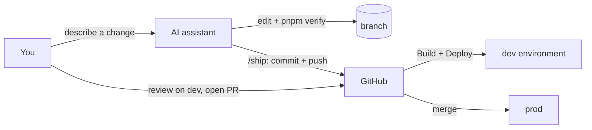

# Working with an AI assistant

The template is built to be worked on with an AI coding assistant. The
assistant writes code, runs the checks, commits and pushes; the pipeline
deploys. Your job becomes describing what you want and reviewing the result.



## The rules file: `AGENTS.md`

[`AGENTS.md`](../AGENTS.md) at the repository root tells any assistant how this
project works: where things are, which commands to run, coding conventions,
and hard limits (never read `.env`, never push to `main`, pushing deploys to
`dev`, no Terraform apply unless asked). Most assistants read it automatically
(Codex, Cursor, Copilot, Gemini CLI, Jules...). `CLAUDE.md` imports it for
Claude Code.

Keep it current: when you add a convention or a command, add a line there.

## Claude Code

Install [Claude Code](https://claude.com/claude-code), then from the
repository root:

```sh
claude
```

Ask for changes in plain language ("add a projects page listing the user's
projects from Supabase, with tests"). Project skills in `.claude/skills/`:

| Command | What it does |
| --- | --- |
| `/ship [intent]` | Creates a branch if you are on `main`, checks for secrets in the diff, runs `pnpm format` + `pnpm verify` (+ Terraform checks when infrastructure changed), writes a Conventional Commit, pushes. The Build workflow then deploys the branch to **dev**. |
| `/deploy <env> [sha]` | Deploys the current branch (or an already-built commit, for a rollback) to `dev`, `staging` or `prod` through GitHub Actions with the `gh` CLI, and follows the run. Asks before touching `prod`. |

Both are marked "user-invoked only": the assistant never pushes or deploys
on its own initiative, only when you type the command.

`.claude/settings.json` pre-approves the safe commands (lint, tests, build,
`git diff`) and denies reading `.env` files, Terraform state and tfvars,
force-pushes and `terraform destroy`.

### A typical session

```text
you   > Add a "Last sign-in" line to the dashboard, with a unit test.
claude> (edits src/pages/dashboard/index.astro, adds a test, runs pnpm verify)
you   > /ship
claude> Committed feat(dashboard): show last sign-in (a1b2c3d) on feat/last-sign-in.
        Pushed. Build workflow running: it will deploy to dev.
you   > (checks the dev URL) Looks good, open a PR.
claude> gh pr create --fill  -> PR #12 (deploys to staging)
```

## Claude on GitHub (optional)

[`.github/workflows/claude.yml`](../.github/workflows/claude.yml) runs Claude
Code in GitHub Actions when someone with write access mentions **`@claude`**
in an issue, a pull request or a review comment: "@claude fix this failing
test", "@claude review this PR", "@claude implement this issue". It follows
`AGENTS.md`, pushes to a branch and opens a PR; the normal pipeline then
deploys that branch to `dev`.

Setup: add the repository secret `ANTHROPIC_API_KEY` (or run
`/install-github-app` inside Claude Code, which configures the GitHub app and
the secret). Without the secret the workflow does nothing useful but harms
nothing.

## Other assistants

Any assistant that can run shell commands works the same way: point it at
`AGENTS.md`, let it run `pnpm verify`, and give it the `/ship` steps from
`.claude/skills/ship/SKILL.md` as instructions. Assistants without shell
access can still edit code; run `pnpm verify` and push yourself.

## Guardrails that make this safe

- **Branches deploy to `dev` only.** Production changes only by merging a PR,
  which you review (protect `main` and require CI in the branch settings).
- **Checks before every deploy.** The Build workflow refuses to upload an
  artifact that fails lint, types or unit tests; CI adds e2e tests on PRs.
- **No secrets in reach.** Runtime secrets live in AWS Secrets Manager, AWS
  access goes through short-lived OIDC credentials, and the assistant is told
  (and configured) not to read `.env` files.
- **Rollback is one command.** `/deploy prod <previous-sha>` or the Deploy
  workflow with a previous SHA.
