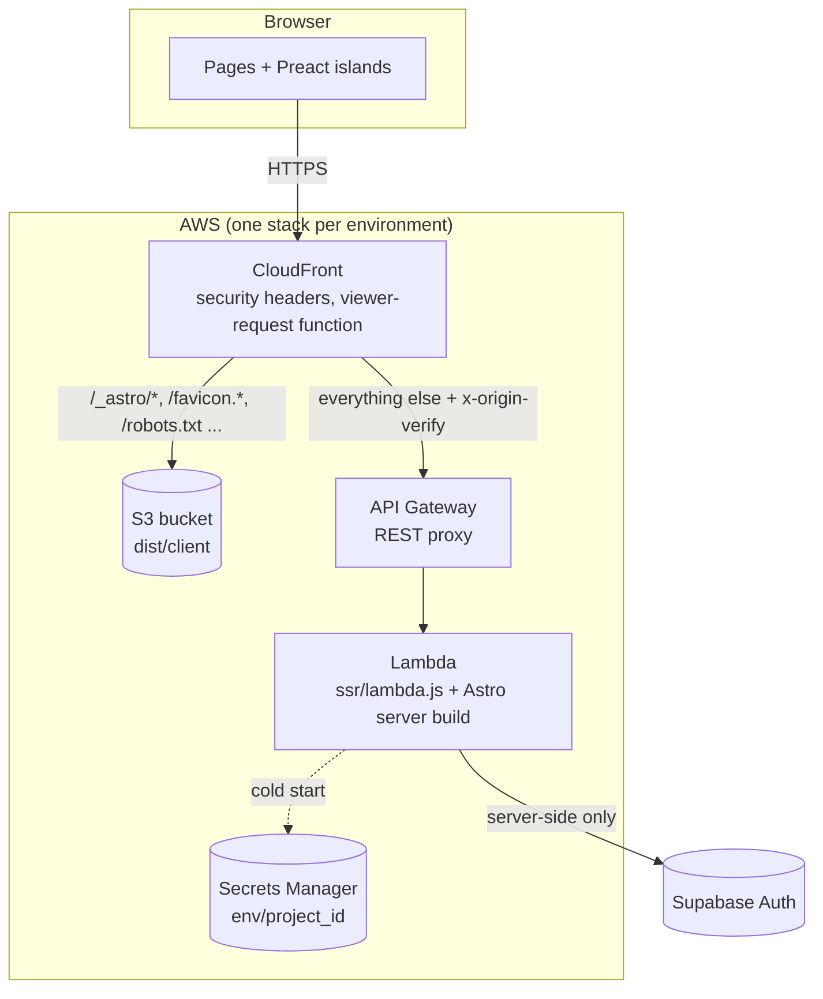
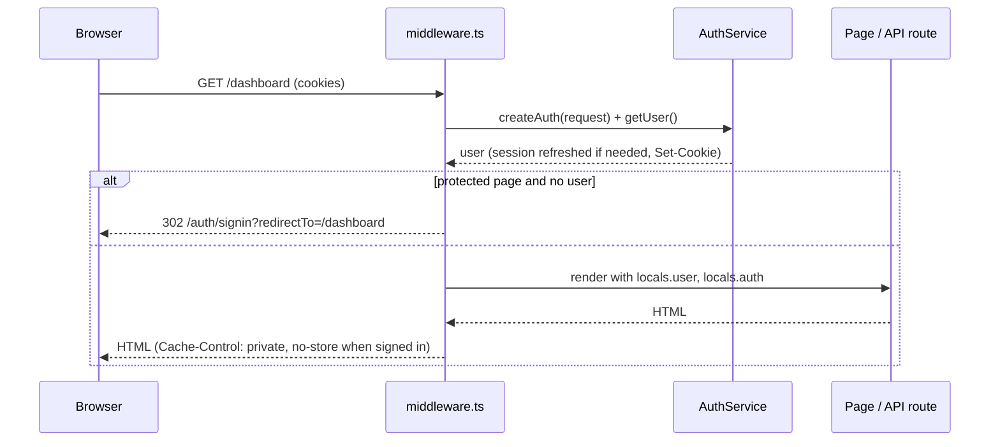
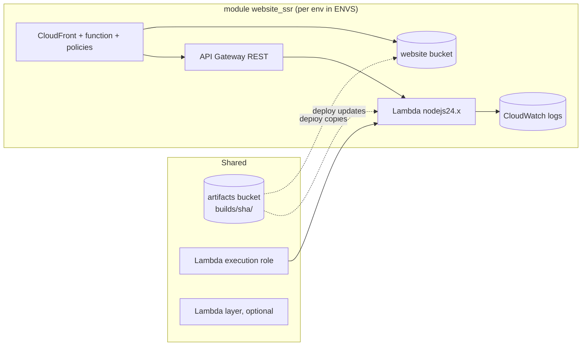
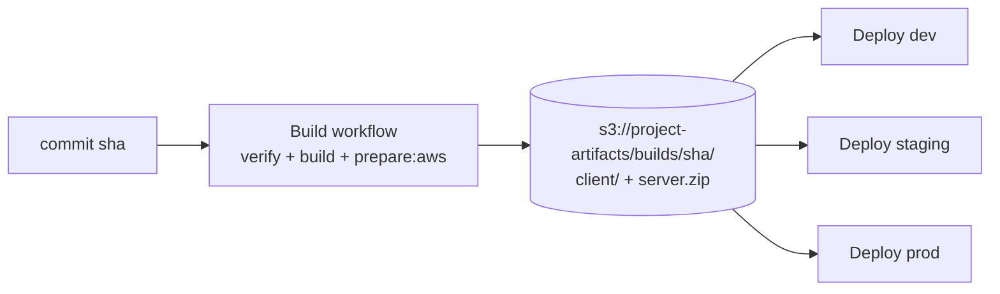

# Architecture

## Overview



- **Static assets** (`dist/client`: hashed JS/CSS bundles, favicon, robots)
  are served from a private S3 bucket through CloudFront (Origin Access
  Control) with a one-year cache.
- **Every other request** (pages, API routes, the auth callback) goes through
  API Gateway to a Lambda running the Astro server build. These responses are
  not cached unless a page opts in with its own `Cache-Control`.
- **Auth** happens on the server. The browser only holds httpOnly cookies and
  posts forms to the app's own API routes.

## Application

```text
website/src/
  middleware.ts          runs on every SSR request
  config/site.ts         product name and description
  lib/
    config.ts            reads env vars at request time (astro:env)
    routes.ts            protected / guest-only / recovery route rules
    validation.ts        input rules shared by forms and API routes
    http.ts              JSON responses, error mapping
    auth/
      types.ts           AuthService interface, AuthUser, AuthError
      index.ts           createAuth(): picks the provider for a request
      supabase.ts        Supabase provider (@supabase/ssr)
      local/             local provider (node:sqlite, scrypt)
    client/              browser helpers (form submission)
  pages/
    index.astro, 404.astro
    auth/                signin, signup, reset-password, update-password, callback
    dashboard/, account/ protected pages
    api/auth/*, api/account/*   form endpoints (POST, JSON responses)
    dev/mailbox.astro    local provider only
  components/            Preact islands: forms, dashboard shell, UI primitives
```

### Request lifecycle



1. `middleware.ts` builds an `AuthService` bound to the request's cookies
   (`locals.auth`) and resolves the user (`locals.user`). An auth outage
   degrades to "signed out" instead of an error page.
2. `lib/routes.ts` decides redirects: protected pages need a user (and
   remember where the visitor was going), guest-only pages send signed-in
   users to the dashboard, the update-password page needs the session created
   by a reset link.
3. Pages read `Astro.locals.user`; API routes call `locals.auth`.
4. Personalized responses get `Cache-Control: private, no-store`.

### The auth interface

Pages and API routes never import a provider. They use `AuthService`
(`lib/auth/types.ts`): `getUser`, `signIn`, `signUp`, `signOut`,
`requestPasswordReset`, `verifyCallback`, `verifyPassword`, `updatePassword`,
`updateProfile`, `deleteAccount`. Failures users should see are `AuthError`s
with a small set of codes (`invalid_credentials`, `rate_limited`, ...), mapped
to HTTP responses in one place (`lib/http.ts`). Anything else is logged and
answered with a generic message: internals never reach the browser.

| | Supabase provider | Local provider |
| --- | --- | --- |
| Storage | Supabase Auth | `node:sqlite` file |
| Session | `sb-<ref>-auth-token` cookies (JWT + refresh token), refreshed by `getUser()` | `local_session` cookie: random token, stored as SHA-256, 7-day sliding expiry |
| Passwords | Supabase (bcrypt) | scrypt (N=2^15), per-password salt, constant-time compare |
| Emails | Supabase / your SMTP | Console + `/dev/mailbox` |
| Email links | PKCE `code`, or `token_hash` + `type` | `token_hash` + `type`, single use, 1 hour |
| Delete account | Admin API (needs `SUPABASE_SECRET_KEY`) | Deletes the row (sessions cascade) |

Both providers behave the same from the outside: generic errors that do not
reveal whether an email has an account, single-use links, sessions in
httpOnly `SameSite=Lax` cookies (`Secure` on HTTPS).

### Emailed links: `/auth/callback`

Sign-up confirmation and password reset emails link to
`/auth/callback?next=...`, which calls `verifyCallback` (Supabase PKCE code
exchange, Supabase token-hash verification, or the local provider's token),
sets the session cookie, then redirects to `next` (validated as a same-site
path). Expired or reused links land on the sign-in page with a message.

### Security measures in the app

- **CSRF**: Astro's origin check (on by default for server output) rejects
  cross-site form posts; cookies are `SameSite=Lax`.
- **Open redirects**: every user-supplied redirect (`redirectTo`, `next`) goes
  through `safeRedirectPath`.
- **Enumeration**: sign-in, sign-up and password reset answer the same way
  whether or not the email exists.
- **Sensitive actions** re-check the password (change password, delete
  account); a password change signs out other devices (local provider;
  Supabase per its settings).
- **Password reset** without the current password is only possible from a
  session created by an emailed link less than 15 minutes ago
  (`isRecoverySession`): a stolen or left-open session cannot use the reset
  page to take over the account.
- **XSS**: all output is escaped by Astro/Preact; URL parameters are never
  echoed (sign-in notices are looked up from a fixed list).

## The Lambda adapter (`website/ssr/`)

Astro's Node adapter (`@astrojs/node`, `middleware` mode) expects Node
`IncomingMessage` / `ServerResponse` objects. `ssr/shim.js` converts an API
Gateway REST event into a readable request stream and collects the response
back into an API Gateway result:

- **Viewer host restored.** API Gateway must receive its own `Host`, so
  CloudFront's viewer-request function copies the browser's host into
  `x-viewer-host` and the shim puts it back. Without it, Astro would see the
  execute-api domain: every form POST would fail the CSRF origin check, and
  emailed links would point at API Gateway.
- **Origin secret.** CloudFront adds `x-origin-verify: <random>` to origin
  requests; the Lambda answers 403 to anything without it, so the public
  execute-api URL cannot be used to bypass CloudFront.
- **Bodies.** Request bodies are streamed (never exposed as `req.body`);
  binary responses are returned base64-encoded (`binary_media_types = */*`).
- **Cookies.** `multiValueHeaders` keep several `Set-Cookie` headers apart.
- **Secrets first.** `lambda.js` loads the environment's Secrets Manager JSON
  into `process.env`, then imports the Astro build, once per container.
- **Self-contained bundle.** `vite.ssr.noExternal: true` bundles every npm
  dependency into `dist/server`; `pnpm prepare:aws` assembles `ssr_dist/`
  (`lambda.js`, `shim.js`, `loadSecrets.cjs`, `dist/server`). The smoke test
  runs it from a directory outside the project to prove it needs no
  `node_modules`.

`ssr/local-server.mjs` runs that same bundle behind a tiny HTTP server that
mimics CloudFront + API Gateway (used by `pnpm preview` and the e2e tests).

## Infrastructure (`infrastructure/`)



- One Terraform state, one `website_ssr` module per environment, gated by
  `envs` (`count`), so a disabled environment costs nothing.
- Resource names follow `<project_id>-<env>-...` conventions the workflows
  rely on: bucket `<project>-<env>-website`, function
  `<project>_<env>_website_ssr`, distribution tagged `env` + `projectId`.
- **Caching**: static paths use the managed CachingOptimized policy and a
  one-year immutable `Cache-Control`. The SSR policy has `default_ttl = 0`:
  nothing is cached unless the response says so; cookies, query strings,
  `Origin` and `x-viewer-host` reach the Lambda.
- **Headers**: CSP, HSTS (one year + preload on prod), `X-Content-Type-Options`,
  `X-Frame-Options: DENY`, `Referrer-Policy`, `Permissions-Policy`,
  `Cross-Origin-Opener-Policy`.
- **Lambda**: Node.js 24, 512 MB, 28 s timeout (API Gateway allows 29 s), logs
  in `/<project>/<env>/website-ssr` with 30-day retention. Terraform creates
  the function with the initial code and then ignores code changes: releases
  go through the Deploy workflow.
- **Secrets**: the Lambda role may read `<env>/<project_id>` secrets only.
  The secret is created outside Terraform so values never enter state.

## Build once, deploy many



Each commit is built once. Deploying adds `client/` to the environment's
bucket (with that environment's `robots.txt`), points the environment's Lambda
at `server.zip`, invalidates CloudFront, and only then removes the previous
build's assets, so pages rendered by the old version never lose their scripts
mid-rollout. What reaches production is
byte-for-byte what was tested on dev and staging, and any previous build can
be redeployed for a rollback. See [Deployment](deployment.md).
