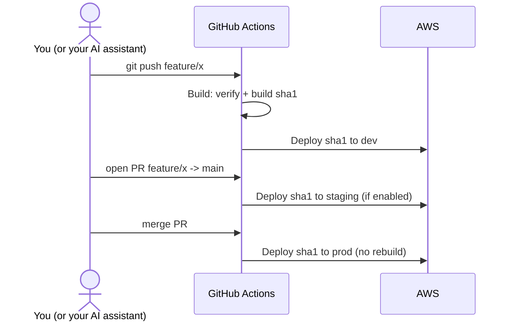

# Deployment

First-time setup (Supabase, AWS account, GitHub variables) is in
[Getting started](getting-started.md). This page explains how releases flow.

## Environments

| Environment | Deployed from | Typical use | Search engines |
| --- | --- | --- | --- |
| `dev` | Every push to a branch other than `main` | Integration, demos | Blocked (`dev_robots.txt`) |
| `staging` | Every PR opened or updated against `main` | Review before release | Blocked (`staging_robots.txt`) |
| `prod` | Merging a PR into `main` | Production | Allowed (`prod_robots.txt`) |

Each deploy copies `public/<env>_robots.txt` to `robots.txt`.

Only the environments listed in the `ENVS` repository variable exist (default
`dev,prod`): Terraform creates nothing for the others and the workflows skip
them. Each environment is an isolated stack with its own bucket, CloudFront
distribution, API, Lambda and secret. Use a separate Supabase project per
environment for full isolation.

## Workflows

| Workflow | Trigger | What it does |
| --- | --- | --- |
| **CI** (`ci.yml`) | PRs, pushes to `main` | Lint, format, types, unit tests, Lambda smoke test, browser e2e tests, Terraform validate + tests. No AWS access. |
| **Build** (`build.yml`) | Push (not `main`), PR events, manual | Lint + types + unit tests, build, upload `builds/<sha>/` to the artifacts bucket, then dispatch **Deploy** for the target environment(s). |
| **Deploy** (`deploy.yml`) | Dispatched by Build, or manual | Copies one build to one environment: adds the new static assets, updates the Lambda code, invalidates CloudFront, then prunes the previous build's assets. |
| **Update Infrastructure** (`update-infrastructure.yml`) | Push to `main` touching `infrastructure/`, manual | `terraform apply` for all enabled environments; publishes each URL as a GitHub Deployment. |
| **Delete Infrastructure** (`delete-infrastructure.yml`) | Manual, type `confirm` | `terraform destroy` of everything. Irreversible. |
| **Claude** (`claude.yml`) | `@claude` mentions | Optional AI assistant, see [AI assistant](ai-assistant.md). |

`build.yml`, `deploy.yml`, `update-infrastructure.yml` and
`delete-infrastructure.yml` follow the emergy.cloud workflow contract: keep
their file names and inputs if the project is managed by the platform.

## Releasing



1. Work on a branch and push. A minute or two later the change is on `dev`.
2. Open a pull request to `main`. CI runs the full test suite; with `staging`
   enabled the PR head is deployed there for review.
3. Merge. The exact artifact that was built for the PR is promoted to `prod`.

Pushing directly to `main` does not deploy: production only changes through
merged pull requests. Protect `main` (Settings > Branches) and require the CI
checks to make that a rule.

### Deploy a specific environment from GitHub

- **Build > Run workflow**: pick a branch, then either type the environments in
  `deploy_environments` (e.g. `staging` or `dev,staging`) or tick
  `deploy_all`. With neither, it only builds.
- **Deploy > Run workflow**: deploy an already-built commit to one
  environment: `environment` = `prod`, `sha` = the full commit SHA. This is
  also how you **roll back**: deploy the previous good SHA (builds are kept 180
  days).

From a terminal: `gh workflow run build.yml --ref my-branch -f deploy_environments=staging`.

### Protect production

The Deploy job runs in a GitHub **Environment** named after the target
(`dev`, `staging`, `prod`). Under Settings > Environments > `prod` you can
require reviewers or restrict which branches deploy, and every production
deploy waits for an approval.

## Infrastructure changes

Changes under `infrastructure/` are applied when they reach `main` (or with
**Update Infrastructure > Run workflow**). To see a plan first, run it from your
machine:

```sh
cp deploy.env.example deploy.env   # once
scripts/deploy.sh infra plan
```

Disabling an environment (removing it from `ENVS`) destroys its stack on the
next apply. Read the plan.

## Manual deploys from your machine

`scripts/deploy.sh` runs the same steps as the workflows with your own AWS
credentials, configured by `deploy.env`:

```sh
scripts/deploy.sh check prod        # tools, AWS account, secret keys
scripts/deploy.sh build             # build + upload builds/<sha>/
scripts/deploy.sh deploy dev        # promote the last build
scripts/deploy.sh ship staging      # build + deploy
scripts/deploy.sh deploy prod <sha> # promote (or roll back to) a given build
scripts/deploy.sh infra apply       # terraform, with a confirmation prompt
scripts/deploy.sh secret prod ./prod.json
```

## Custom domains

Per environment, the hostname is chosen in this order:

1. `HOSTNAME_<ENV>` (exact name, e.g. `app.example.com`), else
2. derived from the base domain (`AWS_WEBSITE_ACM_NAME_<ENV>`, falling back to
   `AWS_WEBSITE_ACM_NAME`): `dev.<base>`, `staging.<base>`, and `www.<base>`
   for prod, where the apex `<base>` also answers and redirects to `www`.

A hostname is only attached when a certificate is available for that
environment (`AWS_WEBSITE_ACM_ARN_<ENV>` or `AWS_WEBSITE_ACM_ARN`). It must be
an ACM certificate in **us-east-1** covering the names (e.g. `example.com` +
`*.example.com`). After `apply`, create DNS records pointing the names at the
CloudFront domains (Terraform output `cloudfront_domains`), then update the
Supabase redirect URLs.

## Observability

- Lambda logs: CloudWatch log group `/<project>/<env>/website-ssr`, one JSON
  line per request (method, path, status, duration) plus app errors.
- Deployed version: `https://<site>/version.txt` contains the commit SHA.
- GitHub **Deployments** page: current URL of each environment.

## Costs

At low traffic everything fits in or near the AWS free tier: CloudFront and
Lambda bill per request, S3 per GB stored, API Gateway per million requests,
plus $0.40 per month per Secrets Manager secret. A disabled environment costs
nothing.

## Upgrading a project created from an older version of this template

The infrastructure changes are applied in place (bucket, distribution, API and
function names are unchanged; `moved` blocks keep the existing stacks), with
three things to check first:

1. **Staging.** Older versions always created `dev`, `staging` and `prod`.
   Environments now follow `ENVS` (default `dev,prod`). If you use staging, set
   `ENVS=dev,staging,prod` **before** the first apply, or the plan destroys the
   staging stack.
2. **Origin secret.** The Lambda starts rejecting requests that do not carry
   CloudFront's secret header. Terraform waits for the CloudFront deployment
   before updating the function, so there is no gap; just expect the apply to
   take a few minutes longer.
3. **Secret key names.** `PUBLIC_SUPABASE_ANON_KEY` keeps working; you can
   rename it to `PUBLIC_SUPABASE_PUBLISHABLE_KEY` at your own pace. Add
   `SUPABASE_SECRET_KEY` to enable account deletion.

Run `scripts/deploy.sh infra plan` (or read the plan in the Update
Infrastructure run) and check the destroy list before applying.

## Tearing down

**Delete Infrastructure > Run workflow**, type `confirm`. This destroys every
environment's buckets (including their contents), distributions, APIs and
functions, and the artifacts bucket. Secrets Manager secrets and the bootstrap
resources (state bucket, deploy role) are left in place; delete them by hand
if the project is gone for good.
